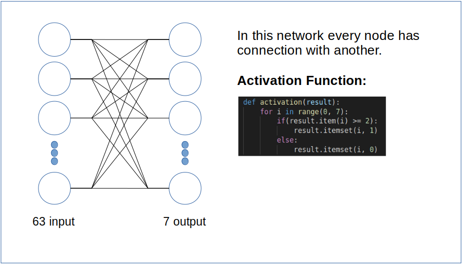

# character analyzing
In this project, I'm using neural networks for recognizing some characters.
- **Input:** Pixels of 7 characters from 3 different font families (**21** characters and **63** inputs in total. I assume that every character is 9*7 image)
- **Output:**
Class of the character (**7** class in total)

## network diagram
